# Coursify - LMS Project

**Made to make learning easier at a very affordable price with doubt support**

## Features

1. **Affordable Access:** Users can access all paid courses for only Rs 499.
2. **Free Courses:** If users don't want to pay for the paid courses, they can access the free courses.
3. **Interactive Comments:** Users can comment below any lecture expressing their doubts or feedback, and they can also delete their comments.
4. **Support Contact:** Users can contact us if they have any issues.
5. **Refund Policy:** Users can get a refund if they cancel their subscription within 14 days of purchasing.
6. **Expert Doubt Clearing:** Users can clear their doubts with experts from the industry and send images of their doubts.
7. **Profile Management:** Users can also change their profile, including their password.
8. **Admin Course Management:** Admin can add courses and delete them as well.
9. **Admin Lecture Management:** Admin can add lectures and delete them as well.
10. **Admin Dashboard:** Admin can view the statistics of all the registered and subscribed users on the Admin Dashboard.

## Screenshots

### Sign Up Page
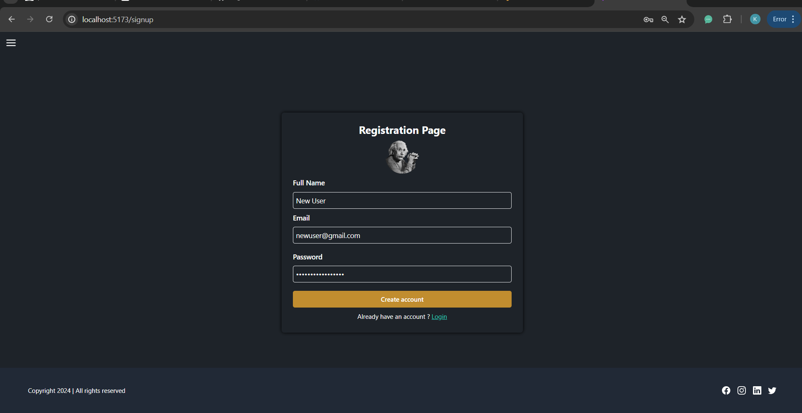

### Home Page
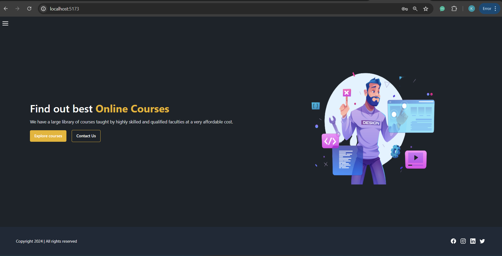

### About Us Page
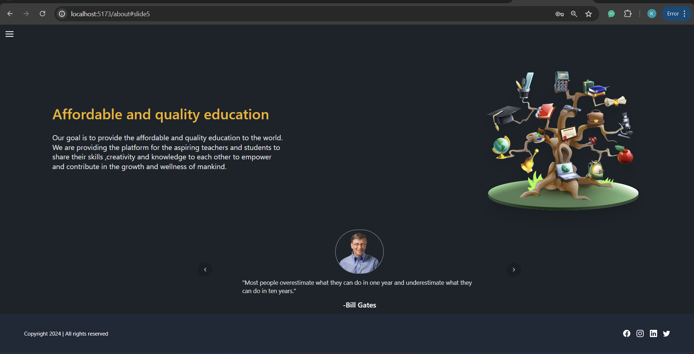

### All Courses Page
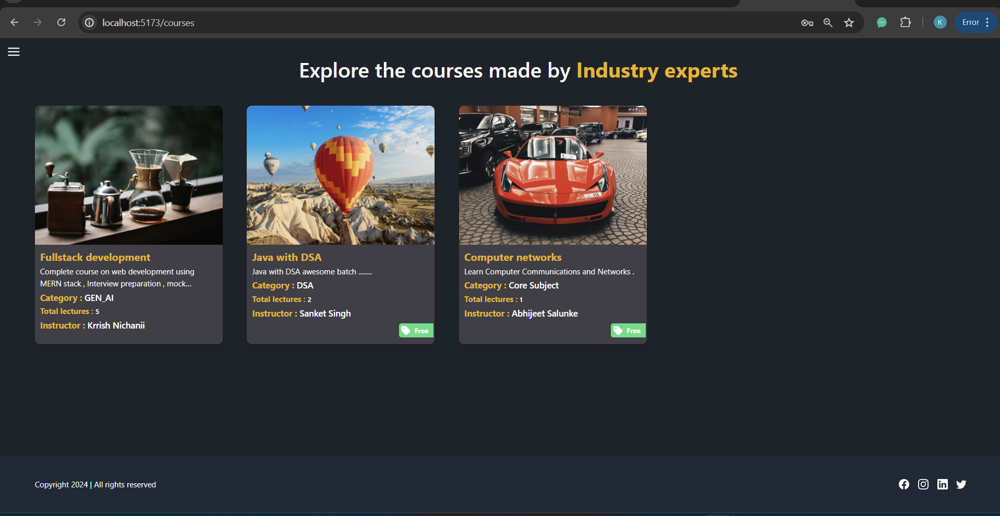

### Lecture Page of Fullstack Development Course
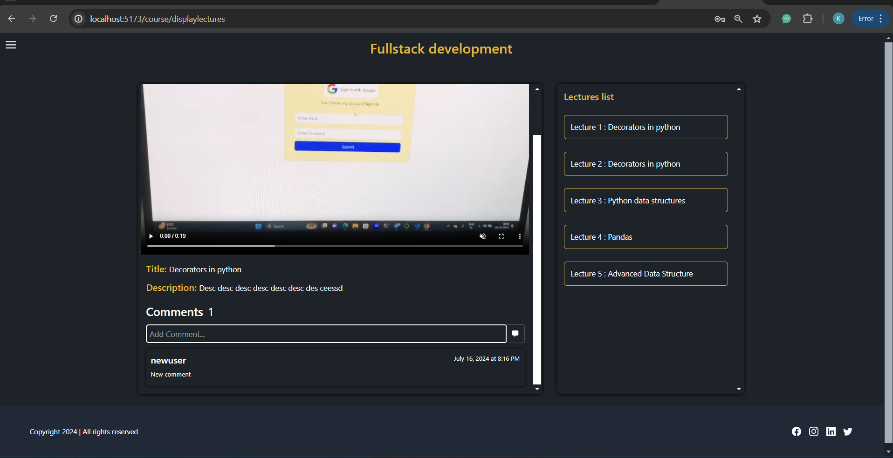

### Student Waiting When All Admins Are Busy
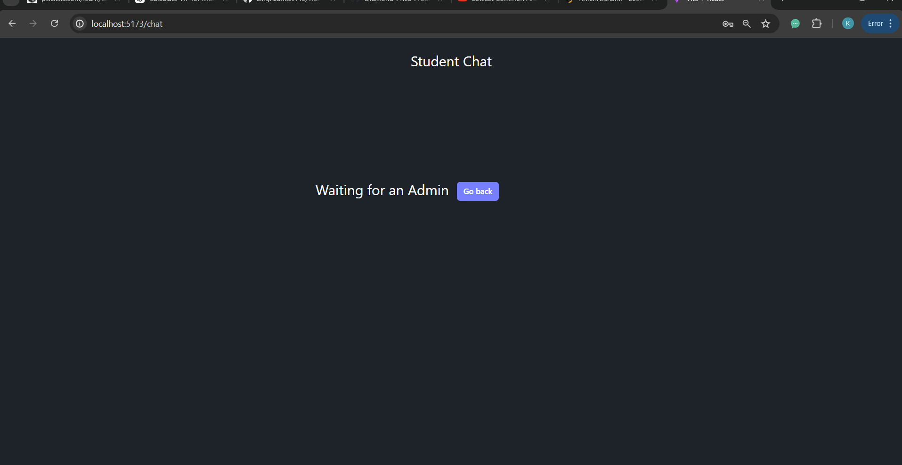

### Student Asking a Doubt to an Admin
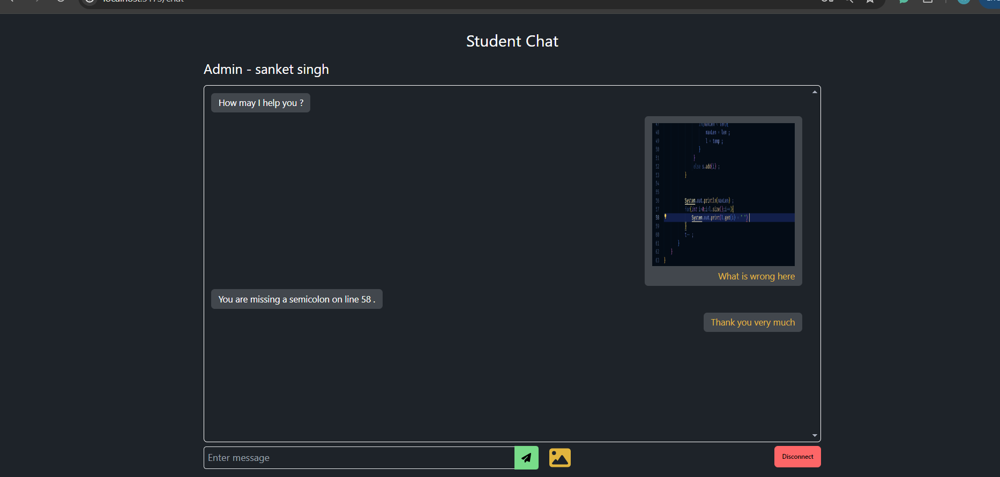

### Admin Answering Doubt
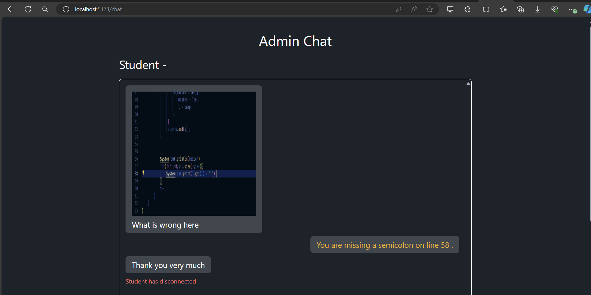

### Modal Feature for Image Clarity
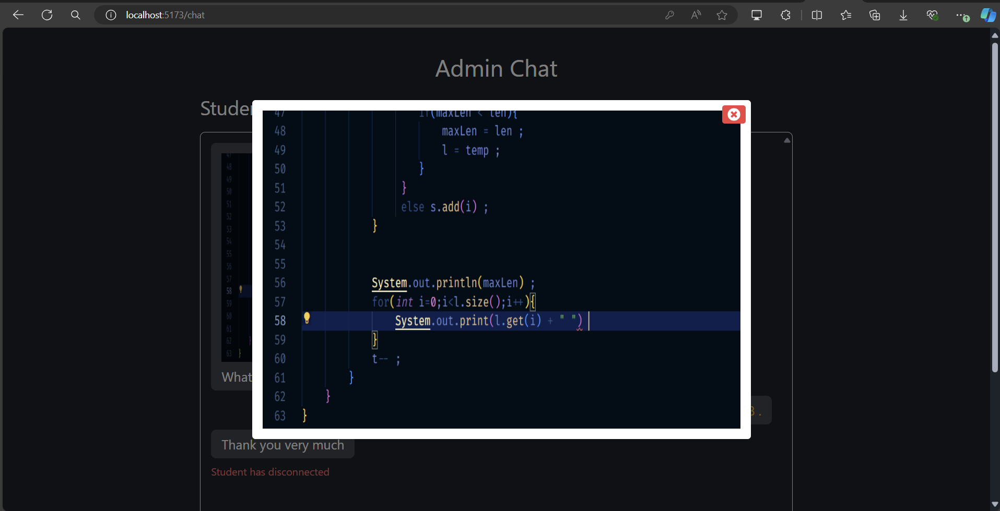

### Profile Page
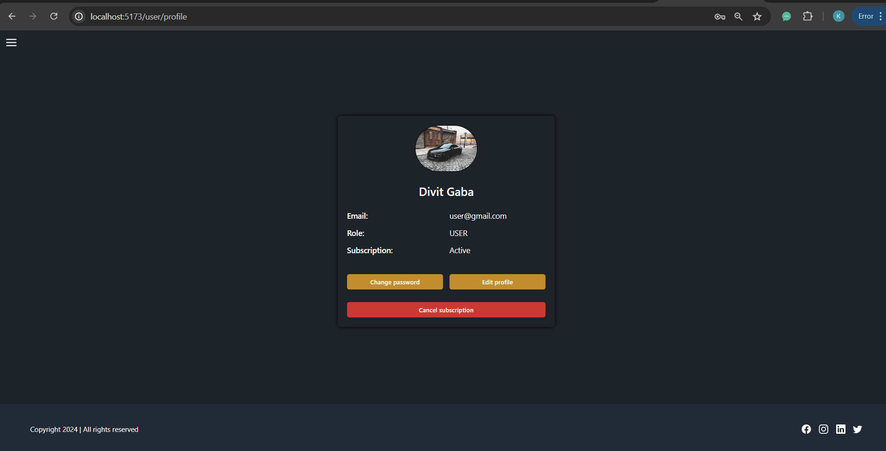

### Subscription Page
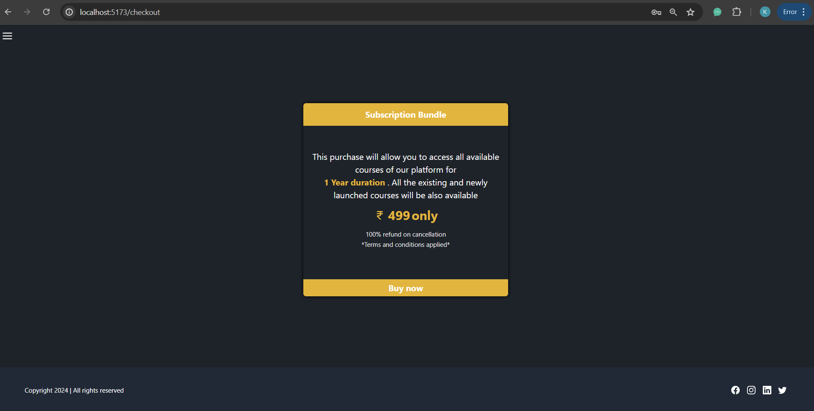

## Usage

1. Open the app in your web browser.
2. Make an account.
3. Access the free courses.
4. Subscribe to access paid courses or clear doubts.

---

**Author**: Krrish Nichanii  
**Email**:  krrishnichanii@gmail.com 
**GitHub**: [KrrishNichanii](https://github.com/KrrishNichanii)

